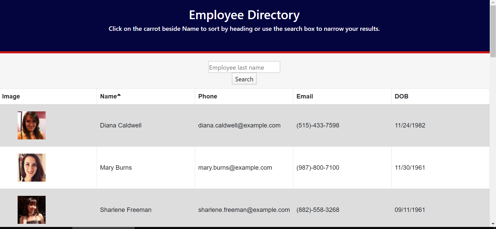

# Employee Directory

## Table of contents
* [General info](#general-info)  
* [User Story](#user-story)  
* [Business Context](#business-context)  
* [Instructions](#instructions)  
* [Link to Deployed App](#link-to-deployed-app)  
* [GitHub Repo](#github-repo)
* [Screenshots](#screenshots) 

## General Info
create a employee directory with React, breaking up your application's UI into components, manage component state, and respond to user events.

## User Story

* As a user, I want to be able to view my entire employee directory at once so that I have quick access to their information.

## Business Context

An employee or manager would benefit greatly from being able to view non-sensitive data about other employees. It would be particularly helpful to be able to filter employees by name.

## Acceptance Criteria

Given a table of random users, when the user loads the page, a table of employees should render. 

The user should be able to:

  * Sort the table by at least one category

  * Filter the users by at least one property.

## Link to Deployed App
https://helmsjames.github.io/User-Directory/

## GitHub Repo:
 https://github.com/helmsjames/User-Directory 

## Screenshots
  The following screenshot demonstrates the application functionality:

  
